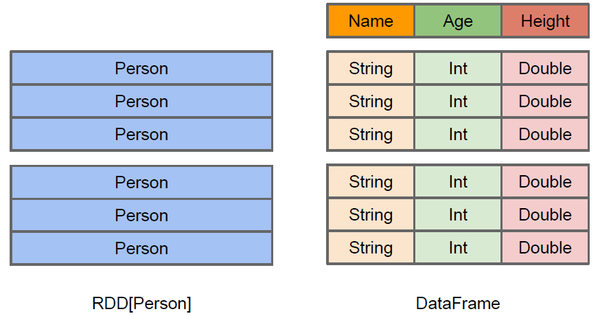

RDD、DataFrame、DataSet的区别及互相转换
------
## RDD和DataFrame区别
DataFrame其实就是RDD+schema，是以列进行组合的分布式数据集。类似于关系型数据库中的表，
和python/R中的data frame很相似。并且具有select、filtering、aggregation、plotting的抽象。
在spark<1.3版本时，对应就是SchemaRDD。

上图直观地体现了DataFrame和RDD的区别。左侧的RDD[Person]虽然以Person为类型参数，
但Spark框架本身不了解Person类的内部结构。而右侧的DataFrame却提供了详细的结构信息，
使得Spark SQL可以清楚地知道该数据集中包含哪些列，每列的名称和类型各是什么。
DataFrame多了数据的结构信息，即schema。RDD是分布式的Java对象的集合。
DataFrame是分布式的Row对象的集合。DataFrame除了提供了比RDD更丰富的算子以外，
更重要的特点是提升执行效率、减少数据读取以及执行计划的优化，比如filter下推、裁剪等。

**DataFrame优点**
1. 提升执行效率

    RDD API是函数式的，强调不变性，在大部分场景下倾向于创建新对象而不是修改老对象。
    这一特点虽然带来了干净整洁的API，却也使得Spark应用程序在运行期倾向于创建大量临时对象，
    对GC造成压力。在现有RDD API的基础之上，我们固然可以利用mapPartitions方法来重载RDD
    单个分片内的数据创建方式，用复用可变对象的方式来减小对象分配和GC的开销，但这牺牲了代码的可读性，
    而且要求开发者对Spark运行时机制有一定的了解，门槛较高。另一方面，Spark SQL在框架内部已经在
    各种可能的情况下尽量重用对象，这样做虽然在内部会打破了不变性，但在将数据返回给用户时，
    还会重新转为不可变数据。利用 DataFrame API进行开发，可以免费地享受到这些优化效果。
2. 减少数据读取
    
    对于一些“智能”数据格 式，Spark SQL还可以根据数据文件中附带的统计信息来进行剪枝。简单来说，在这类数据格式中，
    数据是分段保存的，每段数据都带有最大值、最小值、null值数量等 一些基本的统计信息。当统计信息表名某一数据段肯定
    不包括符合查询条件的目标数据时，该数据段就可以直接跳过（例如某整数列a某段的最大值为100，而查询条件要求a > 200）。
    此外，Spark SQL也可以充分利用RCFile、ORC、Parquet等列式存储格式的优势，仅扫描查询真正涉及的列，忽略其余列的数据。
3.  执行优化
    
    Spark sql会做执行计划的优化，比如filter下推、裁剪等
    
    

