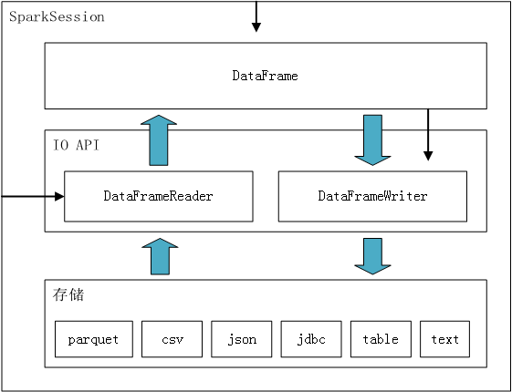

DataFrame各数据源的IO操作
------
Spark SQL支持基于DataFrame操作一系列不同的数据源。



图中包含两种箭头，宽箭头表示数据的流向，细箭头表示提供构造实例的方法。

比如DataFrame - DataFrameWriter - 存储的粗箭头，表示数据从内存通过DataFrameWriter流向存储；
SparkSession - DataFrameReader的细箭头，表示可以从SparkSession对象创建DataFrameReader对象。

## 通用的加载和保存函数
最简单的情况，所有操作都会以默认类型数据源来加载数据（默认是Parquet，除非修改了spark.sql.sources.default 配置）。

```scala
val df = sqlContext.read.load("examples/src/main/resources/users.parquet")
df.select("name", "favorite_color").write.save("namesAndFavColors.parquet")
```
可以手动指定数据源，并设置一些额外的选项参数。数据源可由其全名指定（如，org.apache.spark.sql.parquet），
而对于内建支持的数据源，可以使用简写名（json, parquet, jdbc）。任意类型数据源创建的DataFrame
都可以用下面这种语法转成其他类型数据格式：
```scala
// 读取json文件
val df = sqlContext.read.format("json").load("examples/src/main/resources/people.json")
// 存储成parquet文件
df.select("name", "age").write.format("parquet").save("namesAndAges.parquet")
```
还支持直接对parquet文件使用SQL查询，不需要用read方法把文件加载进：
```scala
val df = sqlContext.sql("SELECT * FROM parquet.`examples/src/main/resources/users.parquet`")
```
**保存模式**

Save操作有一个可选参数SaveMode，用这个参数可以指定如何处理数据当已经存在的情况。
很重要的一点是，**这些保存模式都没有加锁，所以其操作也不是原子性的**。另外，
如果使用Overwrite模式，实际操作是，先删除数据，再写新数据。

| 仅Scala/Java| 所有支持的语言  | 含义 |
|---|---|---|
|SaveMode.ErrorIfExists (default) |"error" (default)|（默认模式）从DataFrame向数据源保存数据时，如果数据已经存在，则抛异常。|
|SaveMode.Append|"append" |如果数据或表已经存在，则将DataFrame的数据追加到已有数据的尾部。|
|SaveMode.Overwrite|"overwrite" |如果数据或表已经存在，则用DataFrame数据覆盖之。|
|SaveMode.Ignore|"ignore" |如果数据已经存在，那就放弃保存DataFrame数据。这和SQL里CREATE TABLE IF NOT EXISTS有点类似。|

**保存数据到持久化表**

DataFrame可以用saveAsTable方法，将数据保存成持久化的表。与createOrReplaceTempView不同，
saveAsTable会将DataFrame的实际数据内容保存下来，并且在HiveMetastore中创建一个游标指针。
持久化的表会一直保留，即使Spark程序重启也没有影响，只要你连接到同一个metastore就可以读取其数据。
读取持久化表时，只需要用用表名作为参数，调用SparkSession.table方法即可得到对应DataFrame。

默认情况下，saveAsTable会创建一个”managed table“，也就是说这个表数据的位置是由metastore控制的。
同样，如果删除表，其数据也会同步删除。当然，对于基于文件的数据源（ text, parquet, json等）
可以通过指定路径选项自定义表路径df.write.option("path", "/some/path").saveAsTable("t")，这样
删除表时，自定义表路径将不会被删除，表数据仍然存在（类似于外部表）。如果未指定自定义表路径，spark会将数据写入warehouse目录下的默认表路径，
删除表时，默认的表路径也将被删除（类似于内部表）。

从Spark2.1开始，持久化表数据时，会将每个分区的元信息在Hive metastore存储，这样的好处有：
- 对于查询元信息返回必要的分区，这样就不需要全表查询所有的分区
- 支持Hive DDLs的ALTER TABLE PARTITION ... SET LOCATION语句

**注意，在创建外部数据源表（具有路径选项的表）时，默认情况下不会收集分区信息。要同步元存储中的分区信息，可以使用MSCK REPAIR TABLE xxx修复表。**

**Bucketing, Sorting and Partitioning**

对于基于文件的数据源，也可以对输出进行存储、排序或分区。存储桶和排序仅适用于持久表：
```scala
peopleDF.write.bucketBy(42, "name").sortBy("age").saveAsTable("people_bucketed")
usersDF.write.partitionBy("favorite_color").format("parquet").save("namesPartByColor.parquet")
peopleDF.write.partitionBy("favorite_color").bucketBy(42, "name").saveAsTable("people_partitioned_bucketed")
```
通过partitionBy创建目录结构，对partitionBy字段是有要求的，需要是数值或字符串类型。在Partition Discovery部分有介绍。
而bucketBy可以将数据分布在固定数量的存储桶中。

## Parquet文件
Parquet是一种流行的列式存储格式。Spark SQL提供对Parquet文件的读写支持，而且Parquet文件能够自动保存原始数据的schema。
写Parquet文件的时候，所有的字段都会自动转成nullable，以便向后兼容。它不是一个单纯的文本文件，包含了一些无法渲染的特殊字符。
parquet是SparkSQL默认的格式。
```scala
// spark.read返回DataFrameReader对象，其load方法加载文件中的数据并返回DataFrame对象。
val usersDF = spark.read.load("src/main/resources/users.parquet")
// DataFrame#write()方法返回DataFrameWriter对象实例，save方法将数据持久化为parquet格式的文件。
// save的参数是一个目录，而且要求最底层的目录是不存在的，
usersDF.write.save("output/parquet/")
```
#### **Parquet特性**
- **Partition Discovery**

    像Hive这样的系统，一个很常用的优化手段就是表分区。在一个支持分区的表中，数据是保存在不同的目录中的，
并且将分区键以编码方式保存在各个分区目录路径中。Parquet数据源现在支持自动发现和推导分区信息。
例如，我们可以把人口数据存到一个分区表中，其目录结构如下所示，其中有2个额外的字段，gender和country，作为分区键：
    ```
    path
    └── to
        └── table
            ├── gender=male
            │   ├── ...
            │   │
            │   ├── country=US
            │   │   └── data.parquet
            │   ├── country=CN
            │   │   └── data.parquet
            │   └── ...
            └── gender=female
                ├── ...
                │
                ├── country=US
                │   └── data.parquet
                ├── country=CN
                │   └── data.parquet
                └── ...
    ```
    在这个例子中，如果需要读取Parquet文件数据，我们只需要把path/to/table作为参数传给SparkSession.read.parquet
或者SparkSession.read.load。Spark SQL能够自动的从路径中提取出分区信息，随后返回的DataFrame的schema如下：
    ```
    root
    |-- name: string (nullable = true)
    |-- age: long (nullable = true)
    |-- gender: string (nullable = true)
    |-- country: string (nullable = true)
    ```
    注意，分区键的数据类型将是自动推导出来的。目前，只支持数值类型和字符串类型数据作为分区键。
有的用户可能不想要自动推导出来的分区键数据类型。这种情况下，可以通过
spark.sql.sources.partitionColumnTypeInference.enabled （默认是true）来禁用分区键类型推导。
禁用之后，分区键总是被当成字符串类型。

    从Spark-1.6.0开始，分区发现默认只在指定目录的子目录中进行。以上面的例子来说，
如果用户把 path/to/table/gender=male 作为参数传给SparkSession.read.parquet 
或者SparkSession.read.load，那么gender就不会被作为分区键。如果用户想要指定分区发现的基础目录，
可以通过basePath选项指定。例如，如果把path/to/table/gender=male作为数据目录，
并且将basePath设为path/to/table，那么gender仍然会最为分区键。
- **Schema Merging**

    像ProtoBuffer、Avro和Thrift一样，Parquet也支持schema演变。用户从一个简单的schema开始，
逐渐增加所需的新字段。这样的话，用户最终会得到多个schema不同但互相兼容的Parquet文件。
目前，Parquet数据源已经支持自动检测这种情况，并合并所有文件的schema。

    因为schema合并相对代价比较大，并且在多数情况下不是必要的，所以从Spark-1.5.0之后，默认是被禁用的。
你可以这样启用这一功能：读取Parquet文件时，将选项mergeSchema设为true 或者，
将全局选项spark.sql.parquet.mergeSchema设为true

    **Hive/Parquet schema转换**

    在读写Hive metastore Parquet表时，Spark SQL用的是内部的Parquet支持库，而不是Hive SerDe，
因为这样性能更好。这一行为是由spark.sql.hive.convertMetastoreParquet配置项来控制的，而且默认是启用的。
需要时可以设置false，SparkSQL将使用Hive SerDe来处理parquet表，而不是使用内置的支持。
例如：Hive中的decimal类型和SparkSQL是有区别的，直接使用会报错：
parquet.io.ParquetDecodingException: Can not read value at 0 in block -1 in file。

    Hive和Parquet在表结构处理上主要有2个不同点：
    1. Hive不区分大小写，而Parquet不是
    2. Hive所有字段都是nullable的，而Parquet需要显示设置

    由于以上原因，我们必须在Hive metastore Parquet table转Spark SQL Parquet table的时候，
对Hive metastore schema做调整，调整规则如下：
    1. 两种schema中字段名和字段类型必须一致。调和后的字段类型必须在Parquet格式中有相对应的数据类型，所以nullable是也是需要考虑的。
    2. 调整后Spark SQL Parquet table schema将包含以下字段：1. 只出现在Parquet schema中的字段将被丢弃;2. 只出现在Hive metastore schema中的字段将被添加进来，并显式地设为nullable。
    
    **刷新元数据**
    
    注意，Spark SQL会缓存Parquet元数据以提高性能。如果Hive metastore Parquet table转换被启用的话，那么转换过来的schema也会被缓存。
    这时候，如果这些表由Hive或其他外部工具更新了，你必须手动刷新元数据。通过sparkSession.catalog.refreshTable()
#### **Parquet配置**
Parquet配置可以通过sparkSession.sqlContext.setConf()或者sparkSession.conf.set()或者SQL语句中SETkey=value来指定。

<table class="table table-bordered table-striped table-condensed">
    <tr>
        <th bgcolor="#4c4c4c">属性名</th>
        <th bgcolor="#4c4c4c">默认值</th>
        <th bgcolor="#4c4c4c">含义</th>
    </tr>
    <tr>
        <td>spark.sql.parquet.binaryAsString</td>
	    <td>false</td>
        <td>有些老系统，如：特定版本的Impala，Hive，或者老版本的Spark SQL，
        不区分二进制数据和字符串类型数据。这个标志的意思是，让Spark SQL把二进制数据当字符串处理，
        以兼容老系统。</td>
    </tr>
    <tr>
       <td>spark.sql.parquet.int96AsTimestamp</td>
        <td>true</td>
       <td>有些老系统，如：特定版本的Impala，Hive，把时间戳存成INT96。
       这个配置的作用是，让Spark SQL把这些INT96解释为timestamp，以兼容老系统。</td>
   </tr>
   <tr>
       <td>spark.sql.parquet.cacheMetadata</td>
       <td>true</td>
       <td>缓存Parquet schema元数据。可以提升查询静态数据的速度。</td>
   </tr>
   <tr>
       <td>spark.sql.parquet.compression.codec</td>
       <td>snappy</td>
       <td>设置Parquet文件的压缩编码格式。可接受的值有：uncompressed, snappy（默认）, gzip, lzo</td>
   </tr>
   <tr>
       <td>spark.sql.parquet.filterPushdown</td>
       <td>true</td>
       <td>启用过滤器下推优化，可以讲过滤条件尽量推导最下层，已取得性能提升</td>
   </tr>
   <tr>
       <td>spark.sql.hive.convertMetastoreParquet</td>
       <td>true</td>
       <td>如果禁用，Spark SQL将使用Hive SerDe，而不是内建的对Parquet tables的支持</td>
   </tr>
   <tr>
       <td>spark.sql.parquet.mergeSchema</td>
       <td>false</td>
       <td>如果设为true，那么Parquet数据源将会merge 所有数据文件的schema，否则，
       schema是从summary file获取的（如果summary file没有设置，则随机选一个）
       </td>
   </tr>
</table>

[Parquet处理示例代码: DataSourceParquet.scala](../src/main/scala/org/spark/notes/DataSourceParquet.scala)
## JSON数据集
Spark SQL在加载JSON数据的时候，可以自动推导其schema并返回DataFrame。
用sparkSession.read.json读取一个包含String的Dataset或者JSON文件，即可实现这一转换。
注意，通常所说的json文件只是包含一些json数据的文件，而不是我们所需要的JSON格式文件。
JSON数据文件必须每一行是一个独立、完整的的JSON对象。对于多行JSON文件，需要设置multiLine选项为true。

[Json处理示例代码: DataSourceJson.scala](../src/main/scala/org/spark/notes/DataSourceJson.scala)

## Hive Tables
Spark SQL支持从Apache Hive读写数据。然而，Hive依赖项太多，所以没有把Hive包含在默认的Spark发布包里。
如果在类路径上可以找到hive依赖项，spark将自动加载它们。注意，hive的jar包也必须出现在所有的worker节点上，
访问Hive数据时候会用到（如：使用hive的序列化和反序列化SerDes时）。

配置hive需要把hive-site.xml，core-site.xml（安全配置），hdfs-site.xml（HDFS配置）配置文件放到spark的conf目录下。

如果使用Hive，则必须构建一个支持hive的SparkSession通过enableHiveSupport()，包括能连接Hive metastore，
支持Hive serdes，以及对Hive 自定义函数的支持。如果用户没有现有的Hive部署，也可以支持Hive。
如果没有hive-site.xml的配置，那么HiveContext将会自动在当前目录下创建一个metastore_db目录，
由spark.sql.warehouse.dir配置，默认为启动spark应用程序的当前目录中的spark-warehouse目录。
注意，hive-site.xml中的hive.metastore.warehouse.dir属性从spark 2.0.0被弃用。
请注意，你必须对metastore_db目录向启动Spark应用程序的用户授予写权限。
#### 为Hive tables指定存储格式
当创建一个Hive表时，需要定义这个表应该如何从文件系统读/写数据，即"input format"和"output format"。
还需要定义此表应如何将数据反序列化为行，或将行序列化为数据，即“serde”。默认情况下，将以纯文本形式读取表文件。
下表介绍存储格式"input format"、"output format"、"serde"的含义：

|属性名|含义|
|---|---|
|fileFormat|文件格式是一种存储格式规范包，包括“serde”、“input format”和“output format”。目前支持6种文件格式：'sequencefile', 'rcfile', 'orc', 'parquet', 'textfile' and 'avro'.|
|inputFormat, outputFormat|这两个选项必须成对出现，如果已经指定了“fileformat”选项，则不能指定它们。值是字符串，类全路径如：org.apache.hadoop.hive.ql.io.orc.OrcInputFormat|
|serde|此选项指定了一个serd class的名称。当文件格式选项被指定时请不要具体说明这一选项。|
|fieldDelim, escapeDelim, collectionDelim, mapkeyDelim, lineDelim|这些选项只能与“textfile”文件格式一起使用。它们定义了如何将分隔文件读取到行中。|

[Hive Table处理示例代码: DataSourceHiveTable.scala](../src/main/scala/org/spark/notes/DataSourceHiveTable.scala)
## 用JDBC连接其他数据库

[Hive Table处理示例代码: DataSourceHiveTable.scala](../src/main/scala/org/spark/notes/DataSourceHiveTable.scala)
## CSV文件
csv默认已逗号做分隔符，即：使用逗号分隔一条数据中各字段的值。csv文件可以被excel解析，但是其本质只是一个文本文件。
还可以使用别的字符做分割符如：\t |等。SparkSQL读取csv文件时也需要注意分割符，可以通过delimiter选项指定，如果csv
带字段头需要设置header=true。加载csv文件返回的DataFrame，其schema所有字段类型默认都是String。

[CSV处理示例代码: DataSourceCSV.scala](../src/main/scala/org/spark/notes/DataSourceCSV.scala)
## 其他格式文件
SparkSQL除了可以读parquet、json、csv格式的文件，还支持text、orc格式。可以使用
spark.read.format()进行统一操作。和上面格式的文件处理方式类似，不过多介绍。
SparkSQL很好的一点是可以通过read、write统一的接口方便的进行数据操作，实现ETL。


       


