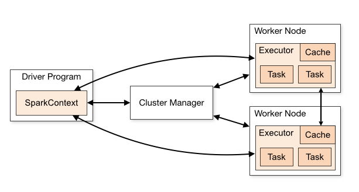
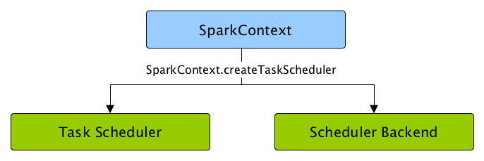

# SparkContext解析

SparkContext为Spark的主要入口点，如果把Spark集群当作服务端那Spark
Driver就是客户端，SparkContext则是客户端的核心：
SparkContext用于连接Spark集群、创建RDD、累加器（accumlator）、广播变量（broadcast
variables）。
也就是说SparkContext是Spark的入口，相当于应用程序的main函数。目前在一个JVM进程中可以创建多个SparkContext，
但是只能有一个active级别的。如果你需要创建一个新的SparkContext实例，必须先调用stop方法停掉当前active级别的SparkContext实例。

 

上图摘自Spark官网，可以看到SparkContext处于DriverProgram核心位置，所有与Cluster、Worker
Node交互的操作都需要SparkContext来完成。
在spark程序运行起来后，程序就会创建sparkContext,执行之前sparkContext还会做很多工作：
如构建顶级三大核心：DAGScheduler，TaskScheduler，SchedulerBackend。


1. DAGScheduler: 是面向Job的Stage的高层调度器。负责创建Job，将DAG中的RDD
   划分到不同的Stage，并将Stage作为Tasksets提交给底层调度器TaskScheduler执行。
2. TaskScheduler:
   是一个接口，是低层调度器，根据具体的ClusterManager的不同会有不同的实现。Standalone
   模式下具体实现的是TaskSchedulerImpl。为Spark的任务调度器，Spark通过他提交任务并且请求集群调度任务。
   因其调度的Task由DAGScheduler创建，所以DAGScheduler是TaskScheduler的前置调度。
3. SchedulerBackend:
   是一个接口，根据具体的ClusterManger的不同会有不同的实现，Standalone模式下具体的实现是LocalSchedulerBackend。
   负责与Master、Worker通信收集Worker上分配给该应用使用的资源情况。负责发送Task到具体的Executor执行。
4. LiveListenerBus: SparkContext中的事件总线，可以接收各种使用方的事件，
   并且异步传递Spark事件监听与SparkListeners监听器的注册。

#### 源码分析：
SparkContext构建全过程： 
###### 1. 初始设置
首先保存了当前的CallSite信息，并且判断是否允许创建多个SparkContext实例，
使用的是spark.driver.allowMultipleContexts属性，默认为false。 
```scala
// 包名：org.apache.spark
// 类名：SparkContext
class SparkContext(config: SparkConf) extends Logging {

  // The call site where this SparkContext was constructed.
  // 获取当前SparkContext的当前调用栈。包含了最靠近栈顶的用户类及最靠近栈底的Scala或者Spark核心类信息
  private val creationSite: CallSite = Utils.getCallSite()

  // If true, log warnings instead of throwing exceptions when multiple SparkContexts are active
  // SparkContext默认只有一个实例。如果在config（SparkConf）中设置了allowMultipleContexts为true，
  // 当存在多个active级别的SparkContext实例时Spark会发生警告，而不是抛出异常，要特别注意。
  // 如果没有配置，则默认为false
  private val allowMultipleContexts: Boolean =
    config.getBoolean("spark.driver.allowMultipleContexts", false)

  // In order to prevent multiple SparkContexts from being active at the same time, mark this
  // context as having started construction.
  // NOTE: this must be placed at the beginning of the SparkContext constructor.
  // 用来确保SparkContext实例的唯一性，并将当前的SparkContext标记为正在构建中，以防止多个SparkContext实例同时成为active级别的。
  SparkContext.markPartiallyConstructed(this, allowMultipleContexts)
  //.......
}
```
接下来是对SparkConf进行复制，然后对各种配置信息进行校验，其中最主要的就是SparkConf必须指定
spark.master（用于设置部署模式）和spark.app.name（应用程序名称）属性，否则会抛出异常。
```scala
private var _conf: SparkConf = _

_conf = config.clone()
_conf.validateSettings()
  
if (!_conf.contains("spark.master")) {
  throw new SparkException("A master URL must be set in your configuration")
}
if (!_conf.contains("spark.app.name")) {
  throw new SparkException("An application name must be set in your configuration")
}
```
###### 2. 创建执行环境SparkEnv
SparkEnv是Spark的执行环境对象，其中包括与众多Executor指向相关的对象。在local模式下Driver会创建Executor，
local-cluster部署模式或者Standalone部署模式下Worker另起的CoarseGrainedExecutorBackend进程中也会创建Executor，
所以SparkEnv存在于Driver或者CoarseGrainedExecutorBackend进程中。
创建SparkEnv主要使用SparkEnv的createDriverEnv方法，有四个参数：conf、isLocal、listenerBus
以及在本地模式下driver运行executor需要的numberCores。 
```scala
private var _env: SparkEnv = _

def isLocal: Boolean = Utils.isLocalMaster(_conf)

// An asynchronous listener bus for Spark events
private[spark] val listenerBus = new LiveListenerBus(this)

// Create the Spark execution environment (cache, map output tracker, etc)
_env = createSparkEnv(_conf, isLocal, listenerBus)
SparkEnv.set(_env)

// This function allows components created by SparkEnv to be mocked in unit tests:
private[spark] def createSparkEnv(
     conf: SparkConf,
     isLocal: Boolean,
     listenerBus: LiveListenerBus): SparkEnv = {
   SparkEnv.createDriverEnv(conf, isLocal, listenerBus, SparkContext.numDriverCores(master))
}

/**
 * 获取在本地模式下执行程序需要的cores个数，否则不需要，为0
 * The number of driver cores to use for execution in local mode, 0 otherwise.
*/
private[spark] def numDriverCores(master: String): Int = {
   def convertToInt(threads: String): Int = {
     if (threads == "*") Runtime.getRuntime.availableProcessors() else threads.toInt
   }
   master match {
     case "local" => 1
     case SparkMasterRegex.LOCAL_N_REGEX(threads) => convertToInt(threads)
     case SparkMasterRegex.LOCAL_N_FAILURES_REGEX(threads, _) => convertToInt(threads)
     case _ => 0 // driver is not used for execution
   }
}
```
###### 3. 创建SparkUI
SparkUI
提供了用浏览器访问具有样式及布局并且提供丰富监控数据的页面。其采用的是时间监听机制。
发送的事件会存入缓存，由定时调度器取出后分配给监听此事件的监听器对监控数据进行更新。
如果不需要SparkUI，则可以将spark.ui.enabled置为false。 
```scala
_ui =
  if (conf.getBoolean("spark.ui.enabled", true)) {
    Some(SparkUI.createLiveUI(this, _conf, listenerBus, _jobProgressListener,
      _env.securityManager, appName, startTime = startTime))
  } else {
    // For tests, do not enable the UI
    None
  }
```
###### 4. Hadoop相关配置
默认情况下，Spark使用HDFS作为分布式文件系统，所以需要获取Hadoop相关的配置信息:
```scala
private var _hadoopConfiguration: Configuration = _

_hadoopConfiguration = SparkHadoopUtil.get.newConfiguration(_conf)
```
获取的配置信息包括： 将Amazon S3文件系统的AWS_ACCESS_KEY_ID和
AWS_SECRET_ACCESS_KEY加载到Hadoop的Configuration；
将SparkConf中所有的以spark.hadoop.开头的属性都赋值到Hadoop的Configuration；
将SparkConf的属性spark.buffer.size复制到Hadoop的Configuration的配置io.file.buffer.size
```scala
// 包名：org.apache.spark.deploy
// 类名：SparkHadoopUtil
/**
* Appends S3-specific, spark.hadoop.*, and spark.buffer.size configurations to a Hadoop
* configuration.
*/
def appendS3AndSparkHadoopConfigurations(conf: SparkConf, hadoopConf: Configuration): Unit = {
    // Note: this null check is around more than just access to the "conf" object to maintain
    // the behavior of the old implementation of this code, for backwards compatibility.
    if (conf != null) {
      // Explicitly check for S3 environment variables
      val keyId = System.getenv("AWS_ACCESS_KEY_ID")
      val accessKey = System.getenv("AWS_SECRET_ACCESS_KEY")
      if (keyId != null && accessKey != null) {
        hadoopConf.set("fs.s3.awsAccessKeyId", keyId)
        hadoopConf.set("fs.s3n.awsAccessKeyId", keyId)
        hadoopConf.set("fs.s3a.access.key", keyId)
        hadoopConf.set("fs.s3.awsSecretAccessKey", accessKey)
        hadoopConf.set("fs.s3n.awsSecretAccessKey", accessKey)
        hadoopConf.set("fs.s3a.secret.key", accessKey)
    
        val sessionToken = System.getenv("AWS_SESSION_TOKEN")
        if (sessionToken != null) {
          hadoopConf.set("fs.s3a.session.token", sessionToken)
        }
      }
      // Copy any "spark.hadoop.foo=bar" system properties into conf as "foo=bar"
      conf.getAll.foreach { case (key, value) =>
        if (key.startsWith("spark.hadoop.")) {
          hadoopConf.set(key.substring("spark.hadoop.".length), value)
        }
      }
      val bufferSize = conf.get("spark.buffer.size", "65536")
      hadoopConf.set("io.file.buffer.size", bufferSize)
    }
}
```
###### 5. Executor环境变量
executorEnvs是由一个HashMap存储,包含的环境变量将会注册应用程序的过程中发送给Master，
Master给Worker发送调度后，Worker最终使用executorEnvs提供的信息启动Executor。
通过配置spark.executor.memory指定Executor占用的内存的大小，也可以配置系统变量
SPARK_EXECUTOR_MEMORY或者SPARK_MEM设置其大小。 
```scala
// Environment variables to pass to our executors.
private[spark] val executorEnvs = HashMap[String, String]()
  
private var _executorMemory: Int = _

_executorMemory = _conf.getOption("spark.executor.memory")
  .orElse(Option(System.getenv("SPARK_EXECUTOR_MEMORY")))
  .orElse(Option(System.getenv("SPARK_MEM"))
  .map(warnSparkMem))
  .map(Utils.memoryStringToMb)
  .getOrElse(1024)
```
###### 6. 注册HeartbeatReceiver心跳接收器
在Spark的实际生产环境中，Executor 是运行在不同的节点上的。在local模式下的
Driver与Executor属于同一个进程，所以Dirver与Executor可以直接使用本地调用交互，
当Executor运行出现问题时Driver可以很方便地知道，例如，通过捕获异常。
但是在生产环境下Driver与Executor很可能不在同一个进程内，他们也许运行在不同的机器上，甚至在不同的机房里，
因此Driver对Executor失去掌握。为了能够掌控Executor，在Driver中创建了这个心跳接收器。
```
// We need to register "HeartbeatReceiver" before "createTaskScheduler" because Executor will
// retrieve "HeartbeatReceiver" in the constructor. (SPARK-6640)
//使用了SparkEnv的子组件NettyRpcEnv的setupEndpoint方法，此方法的作用是想RpcEnv的Dispatcher注册HeartbeatReceiver，
//并返回HeartbeatReceiver的 NettyRpcEndpointRef引用。
_heartbeatReceiver = env.rpcEnv.setupEndpoint(
  HeartbeatReceiver.ENDPOINT_NAME, new HeartbeatReceiver(this))
```
###### 7. 创建任务调度器TaskScheduler
TaskScheduler也是SparkContext的重要组成部分，负责任务的提交，请求集群管理器对任务调度，
并且负责发送的任务到集群，运行它们，任务失败的重试，以及慢任务的在其他节点上重试。
其中给应用程序分配并运行Executor为一级调度，而给任务分配Executor并运行任务则为二级调度。
另外TaskScheduler也可以看做任务调度的客户端。其职责有：
- 为TaskSet创建和维护一个TaskSetManager并追踪任务的本地性以及错误信息；
- 遇到Straggle任务会方到其他的节点进行重试；
- 向DAGScheduler汇报执行情况，包括在Shuffle输出lost的时候报告fetch failed错误等信息；
 


TaskScheduler负责任务调度资源分配，SchedulerBackend负责与Master、Worker通信收集Worker上分配给该应用使用的资源情况。
```scala
private var _schedulerBackend: SchedulerBackend = _
private var _taskScheduler: TaskScheduler = _

val (sched, ts) = SparkContext.createTaskScheduler(this, master, deployMode)
_schedulerBackend = sched
_taskScheduler = ts

//createTaskScheduler方法根据master的配置匹配部署模式，创建TaskSchedulerImpl，并生成不同的SchedulerBackend。
/**
* Create a task scheduler based on a given master URL.
* Return a 2-tuple of the scheduler backend and the task scheduler.
*/
private def createTaskScheduler(
  sc: SparkContext,
  master: String,
  deployMode: String): (SchedulerBackend, TaskScheduler) = {
import SparkMasterRegex._

// When running locally, don't try to re-execute tasks on failure.
val MAX_LOCAL_TASK_FAILURES = 1

master match {
  case "local" =>
    val scheduler = new TaskSchedulerImpl(sc, MAX_LOCAL_TASK_FAILURES, isLocal = true)
    val backend = new LocalSchedulerBackend(sc.getConf, scheduler, 1)
    scheduler.initialize(backend)
    (backend, scheduler)
    //.......
```
###### 8. 创建和启动DAGScheduler
DAGScheduler主要用于在任务正式交给TaskScheduler提交之前做一些准备工作，包括：
创建Job，将DAG中的RDD划分到不同的Stage，提交Stage等等。

 
```scala
@volatile private var _dagScheduler: DAGScheduler = _

//DAGScheduler的数据结构主要维护jobId和stageId的关系、Stage、ActiveJob，以及缓存的RDD的Partition的位置信息
_dagScheduler = new DAGScheduler(this)
```
###### 9 TaskScheduler的启动
TaskScheduler在启动的时候实际是调用了backend的start方法 
```scala
// start TaskScheduler after taskScheduler sets DAGScheduler reference in DAGScheduler's
// constructor
_taskScheduler.start()

// 包名：org.apache.spark.scheduler
// 类名：TaskSchedulerImpl
override def start() {
  backend.start()
  
  if (!isLocal && conf.getBoolean("spark.speculation", false)) {
    logInfo("Starting speculative execution thread")
    speculationScheduler.scheduleWithFixedDelay(new Runnable {
      override def run(): Unit = Utils.tryOrStopSparkContext(sc) {
        checkSpeculatableTasks()
      }
    }, SPECULATION_INTERVAL_MS, SPECULATION_INTERVAL_MS, TimeUnit.MILLISECONDS)
  }
}
```
###### 10. 启动测量系统MetricsSystem
MetricsSystem中三个概念：
- Instance：指定了谁在使用测量系统；Spark按照Instance的不同，区分为Master、Worker、Application、Driver和Executor；
- Source： 指定了从哪里收集测量数据； Source的有两种来源：Spark internal
  source: MasterSource/WorkerSource等； Common source： JvmSource
- Sink：指定了往哪里输出测量数据；Spark目前提供的Sink有ConsoleSink、CsvSink、JmxSink、MetricsServlet、GraphiteSink等；
  Spark使用MetricsServlet作为默认的Sink。
 
MetricsSystem的启动过程包括:
+ 注册Sources
+ 注册Sinks
+ 将Sinks增加Jetty的ServletContextHandler

```scala
// The metrics system for Driver need to be set spark.app.id to app ID.
// So it should start after we get app ID from the task scheduler and set spark.app.id.
_env.metricsSystem.start()
// Attach the driver metrics servlet handler to the web ui after the metrics system is started.
// MetricsSystem启动完毕后，会遍历与Sinks有关的ServletContextHandler，并调用attachHandler将它们绑定到Spark UI上。
_env.metricsSystem.getServletHandlers.foreach(handler => ui.foreach(_.attachHandler(handler)))
```
###### 11. 创建事件日志监听器
EventLoggingListener 是将事件持久化到存储的监听器，是SparkContext
中可选组件。当spark.eventLog.enabled属性为true时启动，默认为false。 创建
EventLoggingListener 的代码： 
```scala
private[spark] def isEventLogEnabled: Boolean = _conf.getBoolean("spark.eventLog.enabled", false)

_eventLogDir =
  if (isEventLogEnabled) {
    val unresolvedDir = conf.get("spark.eventLog.dir", EventLoggingListener.DEFAULT_LOG_DIR)
      .stripSuffix("/")
    Some(Utils.resolveURI(unresolvedDir))
  } else {
    None
  }
  //....   
```
###### 12. 创建和启动ExecutorAllocationManager
ExecutorAllocationManager用于对以分配的Executor进行管理。
默认情况下不会创建ExecutorAllocationManager，可以修改属性spark.dynamicAllocation.enabled为true来创建。
ExecutorAllocationManager可以动态的分配最小Executor的数量、动态分配最大Executor的数量、
每个Executor可以运行的Task数量等配置信息，并对配置信息进行校验。
start方法将ExecutorAllocationListener加入listenerBus中，ExecutorAllocationListener
通过监听listenerBus里的事件，动态的添加、删除Executor。并且通过不断添加Executor，遍历Executor，将超时的Executor杀死并移除。
```scala
val dynamicAllocationEnabled = Utils.isDynamicAllocationEnabled(_conf)
_executorAllocationManager =
  if (dynamicAllocationEnabled) {
    schedulerBackend match {
      case b: ExecutorAllocationClient =>
        Some(new ExecutorAllocationManager(
          schedulerBackend.asInstanceOf[ExecutorAllocationClient], listenerBus, _conf,
          _env.blockManager.master))
      case _ =>
        None
    }
  } else {
    None
  }
_executorAllocationManager.foreach(_.start())
```
###### 13. ContextCleaner的创建与启动
ContextCleaner用于清理超出应用范围的RDD、ShuffleDependency和Broadcast对象。
ContextCleaner的组成：
- referenceQueue: 缓存顶级的AnyRef引用
- referenceBuff：缓存AnyRef的虚引用
- listeners：缓存清理工作的监听器数组
- cleaningThread：用于具体清理工作的线程 
```scala
_cleaner =
  if (_conf.getBoolean("spark.cleaner.referenceTracking", true)) {
    Some(new ContextCleaner(this))
  } else {
    None
  }
_cleaner.foreach(_.start())
```
###### 14. 额外的SparkListener与启动事件
SparkContext中提供了添加用于自定义 SparkListener 的地方: 
```scala
/**
* Registers listeners specified in spark.extraListeners, then starts the listener bus.
* This should be called after all internal listeners have been registered with the listener bus
* (e.g. after the web UI and event logging listeners have been registered).
*/
private def setupAndStartListenerBus(): Unit = {
    // Use reflection to instantiate listeners specified via `spark.extraListeners`
    try {
      val listenerClassNames: Seq[String] =
      
        // 获取用户自定义的 SparkListenser 的类名
        conf.get("spark.extraListeners", "").split(',').map(_.trim).filter(_ != "")
      for (className <- listenerClassNames) {
        
        // 通过发射生成每一个自定义 SparkListenser 的实例，并添加到事件总线的监听列表中
        
        // Use reflection to find the right constructor
        val constructors = {
          val listenerClass = Utils.classForName(className)
          listenerClass
              .getConstructors
              .asInstanceOf[Array[Constructor[_ <: SparkListenerInterface]]]
        }
        val constructorTakingSparkConf = constructors.find { c =>
          c.getParameterTypes.sameElements(Array(classOf[SparkConf]))
        }
        lazy val zeroArgumentConstructor = constructors.find { c =>
          c.getParameterTypes.isEmpty
        }
        val listener: SparkListenerInterface = {
          if (constructorTakingSparkConf.isDefined) {
            constructorTakingSparkConf.get.newInstance(conf)
          } else if (zeroArgumentConstructor.isDefined) {
            zeroArgumentConstructor.get.newInstance()
          } else {
            throw new SparkException(
              s"$className did not have a zero-argument constructor or a" +
                " single-argument constructor that accepts SparkConf. Note: if the class is" +
                " defined inside of another Scala class, then its constructors may accept an" +
                " implicit parameter that references the enclosing class; in this case, you must" +
                " define the listener as a top-level class in order to prevent this extra" +
                " parameter from breaking Spark's ability to find a valid constructor.")
          }
        }
        listenerBus.addListener(listener)
        logInfo(s"Registered listener $className")
      }
    } catch {
      case e: Exception =>
        try {
          stop()
        } finally {
          throw new SparkException(s"Exception when registering SparkListener", e)
        }
    }
    
    listenerBus.start()
    _listenerBusStarted = true
}
```
根据代码描述，setupAndStartListenerBus 的执行步骤如下：
1. 从 spark.extraListeners 属性中获取用户自定义的 SparkListener的类名。用户可以通过逗号分割多个自定义 SparkListener。
2. 通过发射生成每一个自定义 SparkListener 的实例，并添加到事件总线的监听器列表中。
3. 启动事件总线，并将_listenerBusStarted设置为 true。
###### 15. Spark 环境更新
在SparkContext的初始化过程中，可能对其环境造成影响，所以需要更新环境：
SparkContext初始化过程中，如果设置了spark.jars属性，spark.jars指定的jar包将由addJar方法加入httpFileServer的jarDir变量指定的路径下。
每加入一个jar都会调用postEnvironmentUpdate方法更新环境。增加文件与增加jar相同，也会调用postEnvironmentUpdate方法。
###### 16. 投递应用程序启动事件
postApplicationStart方法只是向listenerBus发送了SparkListenerApplicationStart事件：
```scala
/** Post the application start event */
private def postApplicationStart() {
    // Note: this code assumes that the task scheduler has been initialized and has contacted
    // the cluster manager to get an application ID (in case the cluster manager provides one).
    listenerBus.post(SparkListenerApplicationStart(appName, Some(applicationId),
      startTime, sparkUser, applicationAttemptId, schedulerBackend.getDriverLogUrls))
}
```
###### 17. 创建DAGSchedulerSource、BlockManagerSource和ExecutorAllocationManagerSource
首先要调用taskScheduler的postStartHook方法，其目的是为了等待backend就绪。 
```scala
// Post init
_taskScheduler.postStartHook()
_env.metricsSystem.registerSource(_dagScheduler.metricsSource)
_env.metricsSystem.registerSource(new BlockManagerSource(_env.blockManager))
_executorAllocationManager.foreach { e =>
  _env.metricsSystem.registerSource(e.executorAllocationManagerSource)
```
###### 18. 将SparkContext标记为激活
SparkContext初始化的最后将当前SparkContext的状态从contextBeingConstructed（正在构建中）改为activeContext（已激活）
```scala
// In order to prevent multiple SparkContexts from being active at the same time, mark this
// context as having finished construction.
// NOTE: this must be placed at the end of the SparkContext constructor.
SparkContext.setActiveContext(this, allowMultipleContexts)
```
至此，SparkContext的construction构造完成。


