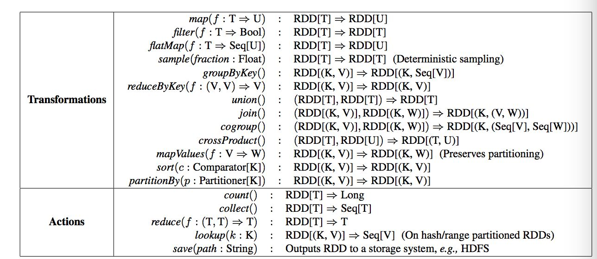
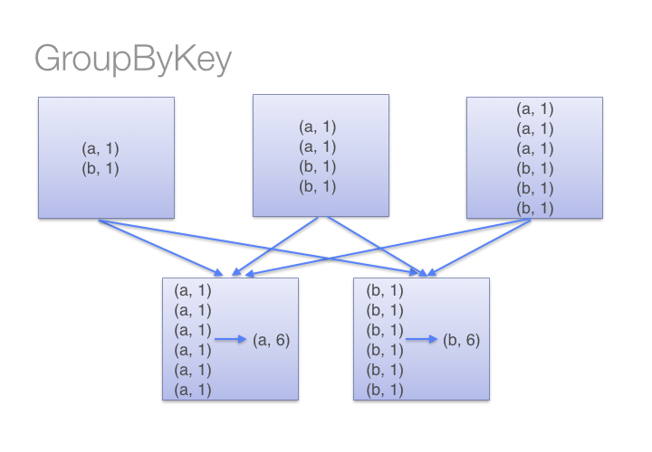
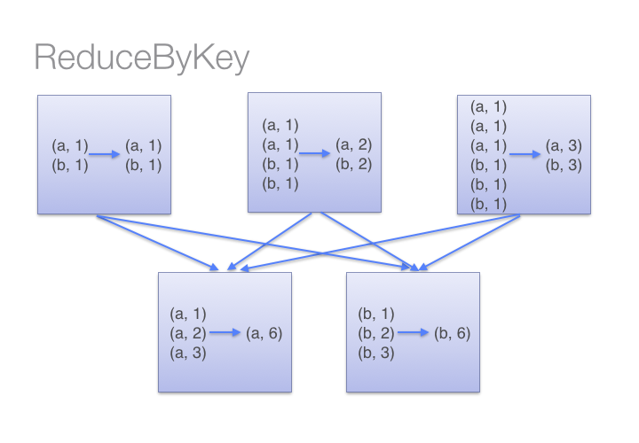

Spark RDD 核心算子介绍 
------
Spark RDD支持两种类型的操作： 
- transformations 转换（从现有数据集创建新的数据集，本质是RDD到RDD）
- actions 操作（在数据集上运行计算后将值返回到驱动程序，本质是RDD到result）

Spark中的所有transformations算子都是惰性的，它们不会立即计算结果。他们只记录应用于数据集上的转换操作
Actions算子则会触发Spark job，将最后结果返回到驱动程序。这种设计使Spark能够更有效地运行。



## [transformations算子](http://spark.apache.org/docs/2.2.0/rdd-programming-guide.html#transformations)
- map(func)

  将函数func作用到数据集的每一个元素上，并返回新的数据集。在T类型的RDD上运行是，func类型
  必须是 T => U
- filter(func)

  选出所有执行func返回值为true的元素，并返回新的数据集。在T类型的RDD运行是，func
  类型必须是 T => Boolean
- flatMap(func)

  将函数func作用到数据集的每一个元素上然后再扁平化，并返回新的数据集
  与map类似，但每个输入项都可以映射到0个或多个输出项因此func应该返回seq而不是单个项
  在T类型的RDD上运行是，func必须是T => Seq(U)
- mapPartitions(func) 

  将函数func作用到数据集的每一个分区上，并返回新的数据集
  与map类似，但在RDD的每个分区（块）上单独运行，因此当在T类型的RDD上运行时，
  func必须是iterator[T] => iterator[U]类型
- mapPartitionsWithIndex(func)

  与mapPartitions类似，但为func提供了表示分区索引的整数值，因此在T类型的RDD上运行时，
  func必须是类型（int，iterator[T]）=> iterator[U]
- groupBy(func)

  根据用户自定义的func进行分组，即将函数func作用到数据集的每一个元素x上，形成(finc(x),x)键值对，再进行groupByKey
  返回新的rdd类型为RDD[(K, Iterable[T])]
- groupByKey([numTasks])
  
  当调用（k，v）对的数据集时，返回（k，iterable<v>）对的数据集,将相同的key的数据分发到一起,可以指定reduce任务的数量。
  注意：如果您分组是为了对每个键执行聚合（如求和或平均值），则使用ReduceByKey或AggregateByKey将产生更好的性能。
  注意：默认情况下，输出中的并行度级别取决于父RDD的分区数。您可以传递一个可选的numtasks参数来设置不同数量的任务。
- reduceByKey(func, [numTasks])
  
  当对（k，v）对的数据集调用时，返回一个（k，v）对的数据集，其中每个键的对应的值使用给定的reduce函数func聚合，
  该函数的类型必须为（v，v）=>v。与groupbykey中一样，reduce任务的数量可以通过可选的第二个参数配置。
- aggregateByKey(zeroValue)(seqOp, combOp, [numTasks])

  当对（k，v）对的数据集调用时，返回一个（k，u）对的数据集，其中每个键的值使用给定的组合函数和初始值进行聚合。
  允许与输入值类型不同的聚合值类型
- sortByKey([ascending], [numTasks])
  
  当对（k，v）对的数据集上调用时，返回由键k按升序或降序排序的（k，v）对的数据集,默认升序
- union(otherDataset)

  将两个数据类型相同的RDD进行合并，并返回新的RDD，新RDD包含所有元素，注意不会去重,并且
  保持原有rdd的partition的个数
- join(otherDataset, [numTasks])

  当对（k，v）和（k，w）类型的数据集调用时，返回一个（k，（v，w））对的数据集。
  外部联接通过leftouterjoin、rightouterjoin和fulloterjoin支持
- cartesian(otherDataset)

  当调用t和u类型的数据集时，返回一个（t，u）对（所有元素对）的数据集。笛卡尔积。
- cogroup(otherDataset, [numTasks])
  
  当调用类型（k，v）和（k，w）的数据集时，返回（k，（iterable<v>，iterable<w>）元组的数据集。
  所有k都会有元素，此操作也称为GroupWith
- coalesce(numPartitions)

  将RDD中的分区数减少到numPartitions。对于过滤大型数据集后更高效地运行操作很有用
- repartition(numPartitions)
  
  随机重组RDD中的数据，以创建更多或更少的分区，并在分区之间进行平衡。这总是在网络上shuffle所有数据
- repartitionAndSortWithinPartitions(partitioner)

  根据给定的分区器对RDD重新分区，并在每个生成的分区内，按键对记录进行排序。这比调用重新分区然后
  在每个分区内进行排序更有效，因为它可以将排序向下推送到shuffle机器上。
- intersection(otherDataset)
  
  取两个数据类型相同的RDD的交集元素，并返回新的RDD，注意相同的元素会去重
- distinct([numTasks]))
  
  返回包含源数据集的不同元素的新数据集
  
- sample(withReplacement, fraction, seed)

  对RDD元素进行采样取数，返回新的RDD。withReplacement：取出的元素是否放回
  fraction：抽取比例 seed：种子如果写死每次抽样相同
  
#### groupByKey和reduceByKey的区别
groupByKey([num Tasks]) ：当键值对(K,V)数据集调用此方法，会返回一个键值对(K,
Iterable)数据集，其中键值是原来键值组成的、可遍历的集合。我们也可以通过num
Tasks参数指定任务执行的次数。

reduceByKey(func[,num Tasks])：
当键值相同的键值对(K,V)数据集调用此方法，他们的键对应的值会根据指定的函数(func)进行聚合，
而键值(V,V)也进行合并，返回键值(V)，最终返回一个键值对(K,V)数据集。当然，也可以通过可选参数num
Tasks，指定任务执行的次数。
```scala
//两种不同的方式来实现对单词出现次数进行统计：
val words = Array("one", "two", "two", "three", "three", "three")
val wordPairsRDD = sc.parallelize(words).map(word => (word, 1))
val wordCountsWithReduce = wordPairsRDD.reduceByKey(_ + _).collect()
val wordCountsWithGroup = wordPairsRDD.groupByKey().map(t => (t._1, t._2.sum)).collect()
```


**两者区别：**

groupByKey()是对RDD中的所有数据做shuffle,根据不同的Key映射到不同的partition中再进行aggregate

reduceByKey()也是先在单台机器中计算，再将结果进行shuffle，（shuffe前进行了combine）减小运算量，大数据情况下效率更优

## [Actions算子](http://spark.apache.org/docs/2.2.0/rdd-programming-guide.html#actions)
- reduce(func)

  将RDD中元素两两传递给输入函数func 同时产生一个新的值，
  新产生的值与RDD中下一个元素再被传递给输入函数直到最后只有一个值为止
- collect()

  将分布式数据集所有元素拉取到driver端，慎用
- count()

  返回数据集中的元素个数
- first()

  返回数据集的第一个元素（类似于take（1））
- take(n)

  返回数据集前n个元素的数组
- takeSample(withReplacement, num, [seed])	

  返回一个数组，该数组包含数据集num个元素的随机样本
- takeOrdered(n, [ordering])
  
  返回RDD的前n个元素，使用它们按自然顺序或自定义比较器顺序
- saveAsTextFile(path)	
  
  将数据集的元素作为文本文件（或一组文本文件受并行度影响）写入本地文件系统、HDFS或任何其他支持Hadoop的文件系统的给定目录中。
  spark将对每个元素调用toString，将其转换为文件中的一行文本。
- countByKey()

  仅当对（k，v）对的数据集调用时，返回一个（k，int）对的hashmap
- foreach(func)	

  遍历数据集的每个元素进行func操作。该函数的类型必须为T => Unit

SparkRDD API还公开了一些Actions操作的异步版本，比如foreach的foreachasync，
它会立即向调用者返回FutureAction，而不是阻塞直到操作完成时。这可用于管理或等待动作的异步执行。


