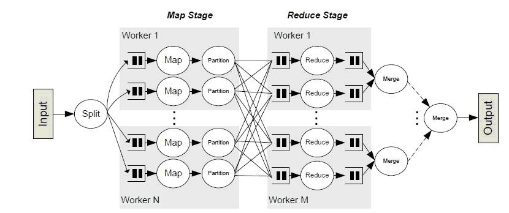
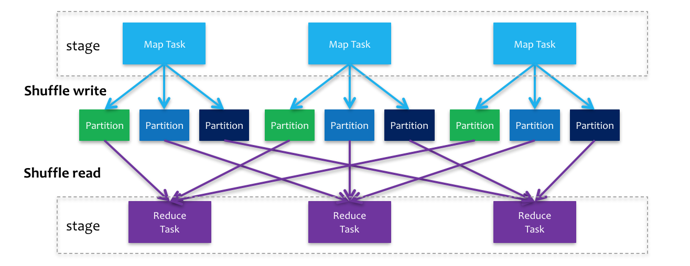
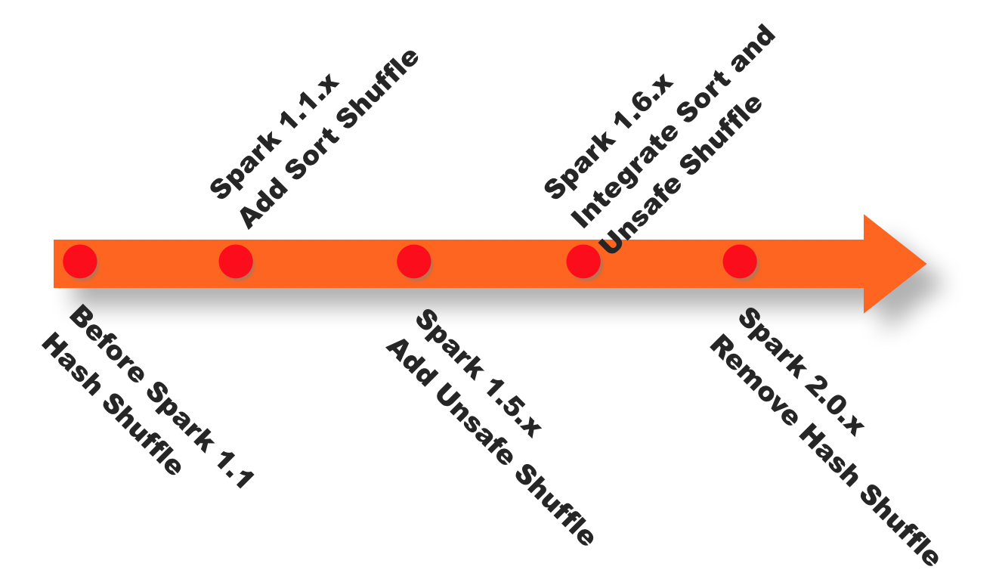
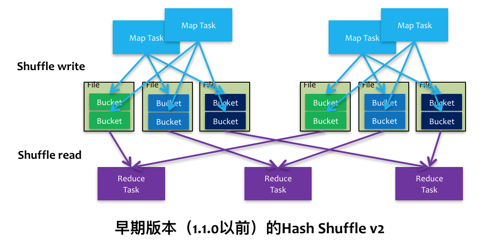

Spark Shuffle实现原理及相关调优 
------
* [Contents](#Contents)
	* [基本原理与特性](#基本原理与特性)
	* [SparkShuffle实现演化史](#SparkShuffle实现演化史)
	  * [Hash Shuffle v1](#Hash-Shuffle-v1)
	  * [Hash Shuffle v2](#Hash-Shuffle-v2)
	  * [Sort Shuffle v1](#Sort-Shuffle-v1)
	  * [Unsafe Shuffle](#Unsafe-Shuffle)
	  * [Sort Shuffle v2](#Sort-Shuffle-v2)
	* [调优](#调优)

Spark在DAG调度阶段会将一个Job划分为多个Stage，上游Stage做map工作，下游Stage做reduce工作，
其本质上还是MapReduce计算框架。Shuffle是连接map和reduce之间的桥梁，它将map的输出对应到reduce输入中
，这期间涉及到序列化反序列化、跨节点网络IO以及磁盘读写IO等，所以说Shuffle是整个应用程序运行过程中
非常昂贵的一个阶段，理解Spark Shuffle原理有助于优化Spark应用程序。

下图描述了MapReduce算法的整个流程，其中shuffle phase是介于Map phase和Reduce phase之间：



## 基本原理与特性
与MapReduce计算框架一样，Spark的Shuffle实现大致如下图所示，在DAG阶段以shuffle为界，划分stage，
上游stage做map task，每个map task将计算结果数据分成多份，每一份对应到下游stage的每个partition中，
并将其临时写到磁盘，该过程叫做shuffle write；下游stage做reduce task，每个reduce task通过网络拉取
上游stage中所有map task的指定分区结果数据，该过程叫做shuffle read，最后完成reduce的业务逻辑。

举个例子，假如上游stage有100个map task，下游stage有1000个reduce task，那么这100个map task中每个map task
都会得到1000份数据，而1000个reduce task中的每个reduce task都会拉取上游100个map task对应的那份数据，
即第一个reduce task会拉取所有map task结果数据的第一份，以此类推。这样上游stage将会产生100*1000个临时文件。
上游一个Mapper会根据Reducer的数量创建出相应的partition，partition的数量是M×R，其中M是Map的个数，R是Reduce的个数。



在map阶段，除了map的业务逻辑外，还有shuffle write的过程，这个过程涉及到序列化、磁盘IO等耗时操作；
在reduce阶段，除了reduce的业务逻辑外，还有前面shuffle read过程，这个过程涉及到网络IO、反序列化等耗时操作。
所以整个shuffle过程是极其昂贵的，spark在shuffle的实现上也做了很多优化改进，随着版本的迭代发布，
spark shuffle的实现也逐步得到改进。

**值得注意的是：**

**虽然shuffle后的每个分区中的元素集是确定的，分区本身的顺序也是确定的，但分区的这些元素不是按顺序的。
如果希望shuffle后按预期顺序排列数据，那么可以使用：**
1. mapPartitions后对分区数据进行sort
2. repartitionAndSortWithinPartitions在重新分区的同时高效地对分区数据进行排序
3. sortBy使Rdd数据全局有序

## SparkShuffle实现演化史
Spark在1.1以前的版本一直是采用Hash Shuffle的实现的方式，到1.1版本时参考Hadoop MapReduce的实现开始引入Sort Shuffle，
在1.5版本时开始Tungsten钨丝计划，引入UnSafe Shuffle优化内存及CPU的使用，在1.6中将Tungsten统一到Sort Shuffle中，
实现自我感知选择最佳Shuffle方式，到2.0版本，Hash Shuffle已被删除，所有Shuffle方式全部统一到Sort Shuffle一个实现中。
下图是spark shuffle实现的一个版本演进：



### Hash Shuffle v1
在spark-1.1版本以前，spark内部实现的是Hash Shuffle，其大致原理与前面基本原理介绍中提到的基本一样，如下图所示：


在map阶段(shuffle write)，每个map都会为下游stage的每个partition写一个临时文件，假如下游stage有1000个partition，
那么每个map都会生成1000个临时文件，一般来说一个executor上会运行多个map task，这样下来，一个executor上会有非常多的临时文件，
假如一个executor上运行M个map task，下游stage有N个partition，那么一个executor上会生成MN个文件。另一方面，
如果一个executor上有K个core，那么executor同时可运行K个task，这样一来，就会同时申请KN个文件描述符，一旦partition数较多，
势必会耗尽executor上的文件描述符，同时生成K*N个write handler也会带来大量内存的消耗。

在reduce阶段(shuffle read)，每个reduce task都会拉取所有map对应的那部分partition数据，那么executor会打开所有临时文件准备网络传输，
这里又涉及到大量文件描述符，另外，如果reduce阶段有combiner操作，那么它会把网络中拉到的数据保存在一个HashMap中进行合并操作，
如果数据量较大，很容易引发OOM操作。

综上所述，Hash Shuffle实现简单但是特别naive，在小数据量下运行比较快，一旦数据量较大，基本就垮了。当然这个版本的shuffle也是在spark早期版本中，
随着版本迭代的进行，shuffle的实现也越来越成熟。

### Hash Shuffle v2
v1版的hash shuffle每个map task都要生成N个partition文件，为了减少文件数，后面进行改进，目的是减少单个executor上的文件数。如下图所示，
一个executor上所有的map task生成的分区文件只有一份，即将所有的map task相同的分区文件合并，这样每个executor上最多只生成N个分区文件。



这种形式看着减少了文件数，但是假如下游stage的分区数N很大，还是会在每个executor上生成N个文件，同样，如果一个executor上有K个core，
还是会开K*N个writer handler，总体上来说基本没太解决问题。对于shuffle read阶段跟v1版一样没改进，仍然容易导致OOM。

### Sort Shuffle v1
针对Hash Shuffle的弊端，在spark 1.1.0版本中引入Sort Shuffle，它参考了Hadoop MapReduce中的shuffle实现，
对记录进行排序来做shuffle，如下图所示：


在map阶段(shuffle write)，会按照partition id以及key对记录进行排序，将所有partition的数据写在同一个文件中，
该文件中的记录首先是按照partition id排序一个一个分区的顺序排列，每个partition内部是按照key进行排序存放，
map task运行期间会顺序写每个partition的数据，并通过一个索引文件记录每个partition的大小和偏移量。
这样一来，每个map task一次只开两个文件描述符，一个写数据，一个写索引，大大减轻了Hash Shuffle大量文件描述符的问题，
即使一个executor有K个core，那么最多一次性开K*2个文件描述符。

在reduce阶段(shuffle read)，reduce task拉取数据做combine时不再是采用HashMap，而是采用ExternalAppendOnlyMap，
该数据结构在做combine时，如果内存不足，会刷写磁盘，很大程度的保证了鲁棒性，避免大数据情况下的OOM。

总体上看来Sort Shuffle解决了Hash Shuffle的所有弊端，但是因为需要其shuffle过程需要对记录进行排序，所以在性能上有所损失。

### Unsafe Shuffle
从spark 1.5.0开始，spark开始了钨丝计划(Tungsten)，目的是优化内存和CPU的使用，进一步提升spark的性能。
为此，引入Unsafe Shuffle，它的做法是将数据记录用二进制的方式存储，直接在序列化的二进制数据上sort而不是在java 对象上，
这样一方面可以减少memory的使用和GC的开销，另一方面避免shuffle过程中频繁的序列化以及反序列化。在排序过程中，
它提供cache-efficient sorter，使用一个8 bytes的指针，把排序转化成了一个指针数组的排序，极大的优化了排序性能。

但是使用Unsafe Shuffle有几个限制，shuffle阶段不能有aggregate操作，分区数不能超过一定大小(2^24-1，这是可编码的最大parition id)，
所以像reduceByKey这类有aggregate操作的算子是不能使用Unsafe Shuffle，它会退化采用Sort Shuffle。

### Sort Shuffle v2
从spark-1.6.0开始，把Sort Shuffle和Unsafe Shuffle全部统一到Sort Shuffle中，
如果检测到满足Unsafe Shuffle条件会自动采用Unsafe Shuffle，否则采用Sort Shuffle。
从spark-2.0.0开始，spark把Hash Shuffle移除，可以说目前spark-2.0中只有一种Shuffle，
即为Sort Shuffle。

## 调优
从上述shuffle的原理介绍可以知道，shuffle是一个涉及到CPU(序列化反序列化)、网络IO(跨节点数据传输)
以及磁盘IO(shuffle中间结果落地)的操作，在编写spark应用程序的时候应当尽可能考虑shuffle相关的优化，
提升spark应用程序的性能。
1. 尽量减少shuffle次数

```scala
// 两次shuffle
rdd.map(...).repartition(1000).reduceByKey(_ + _, 3000)

// 一次shuffle
rdd.map(...).repartition(3000).reduceByKey(_ + _)
```

2. 必要时主动shuffle，通常用于改变并行度，提高后续分布式运行速度

```
rdd.repartiton(largerNumPartition).map(...)
```

3. 分批聚合
使用treeReduce & treeAggregate替换reduce & aggregate。数据量较大时，reduce & aggregate一次性聚合，
shuffle量太大，而treeReduce & treeAggregate是分批聚合，更为保险。


